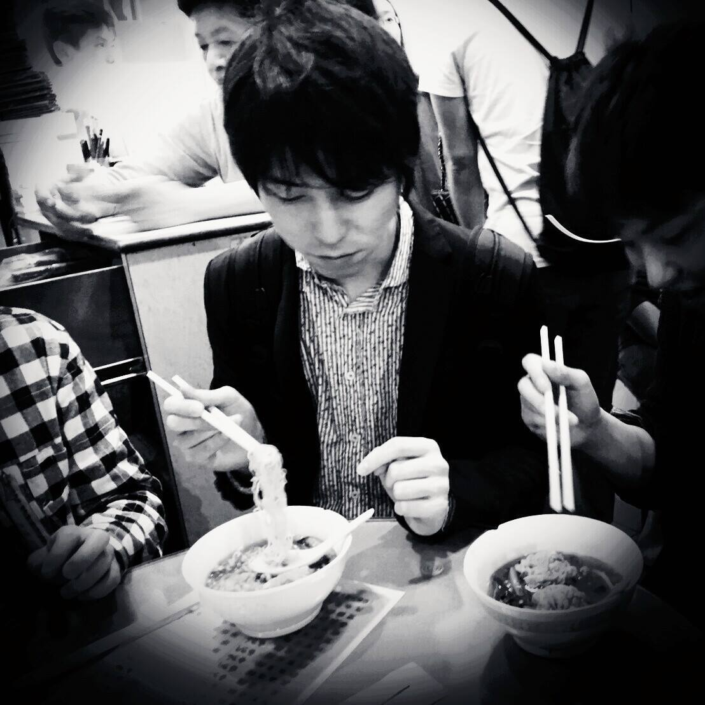
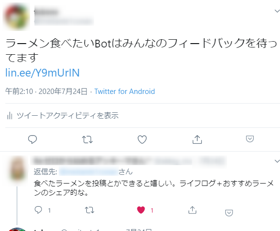

# ラーメンたべたい

Yu Otsubo

---

## 自己紹介

- Yu Otsubo
- 27歳・独身
- Chatbotの開発をしてます

---

## 突然ですが

---

<!-- .slide: data-background="img/img_bb7d5b7877588c054e79d31c1b4e6587231905.jpg" -->

---

## いかがお過ごしでしたか？
<!-- .slide: data-background="#02A8F4" -->

---

## GoToできないキャンペーンをどう有意義に過ごすか？
- - -
- ゲームする <!-- .element: class="fragment" data-fragment-index="1" -->
- 本を読む <!-- .element: class="fragment" data-fragment-index="2" -->
- YouTubeを見る <!-- .element: class="fragment" data-fragment-index="3" -->
- サービス開発をする <!-- .element: class="fragment" data-fragment-index="4" -->

---

## サービス開発をする
<!-- .slide: data-background="#ff5152" -->

---

## じゃあ何作る？

---

  
  
  

---

## みんなラーメンたべたいらしい

---

## 4連休でラーメンに関係するサービスを開発しよう
<!-- .slide: data-background="#01BBD4" -->

---

# 1日目

---

だらだら...

---

# 2日目

---

だらだら...

---

# あと2日しかない！！
<!-- .slide: data-background="#B867C6" -->

---

## RTA始動！

---

## ラーメン食べたい開発RTA始動！

> 世の中はすべてRTAである
> <footer>—Yu Otsubo</footer>

---

## ラーメン食べたい開発RTAの掟

- 残り**2日**でラーメンに関するそこそこのサービスを作る <!-- .element: class="fragment" data-fragment-index="1" -->
- カネがないので**無料**で作る <!-- .element: class="fragment" data-fragment-index="2" -->
- **要望**には全力で答える <!-- .element: class="fragment" data-fragment-index="3" -->
- ちゃんと**テスト・CI**にも力を入れる <!-- .element: class="fragment" data-fragment-index="4" -->

---

# RTA1日目
<!-- .slide: data-background="#01BBD4" -->

---

## とりあえず設計

---

## 10分で書いた

---

## 技術選定

開発RTAでは難しすぎず、かと言って陳腐すぎない技術を選ぶことが勝利の鍵

---

## LINE Messaging API

LINEにBotアカウントをつくる

無料だしドキュメントが本当に丁寧で開発RTA民にとってはありがたいおもちゃ

<video src="https://developers.line.biz/media/videos/messagingapi.mp4"></video>

---

## Google Apps Script

Googleスプレッドシートのマクロ機能だが、APIコール、エンドポイント作成など大体のことはできます。

こちらも無料だし、RTA民にはありがたいおもちゃ

---

## Clasp

GASでの開発をサポートしてくれるすごいやつ

- TypeScriptで書ける！
- テストも書ける！
- CIに乗っけやすい！

---

## ぐるなびAPI

位置情報を送ると、近くのお店情報を返してくれる

---

## 雑シーケンス

つくるぞ〜

---

## できた

<video src="https://github.com/tubone24/slides/raw/master/20200824-ramen-tabetai/img/dekita.mp4" width="312" height="624"></video>

---

## 1日目終了

---

## 2日目
<!-- .slide: data-background="#FF3F80" -->

---

## 要望が来る

ラーメンライフログを作って！

---

## RTAの掟

要望には全力で答える

---

## 技術選定

---

## Firebase&Nuxt.js

Firebaseでホスティング&DB。ライフログ画面はNuxt.jsでパパっと作る

---

## できた

<video src="https://github.com/tubone24/slides/raw/master/20200824-ramen-tabetai/img/ramen.mp4" width="312" height="624"></video>&nbsp;<video src="https://github.com/tubone24/slides/raw/master/20200824-ramen-tabetai/img/ramen2.mp4" width="312" height="624"></video>

---

## RTAの掟

テスト・CIもきちんと

---

### テスト書いた/CI整えた！

  
  
  

GitHub ActionsとJestを使って継続的な開発も余裕！

---

## RTA成功🎉

ニューノーマルな休日の過ごし方でした。

みんなもやってみよう！

PRも待ってます。 <https://github.com/tubone24/ramen-tabetai>

---

### ラーメンたべたいBotをフォローしよう!

&nbsp;

---

# Thank you

---