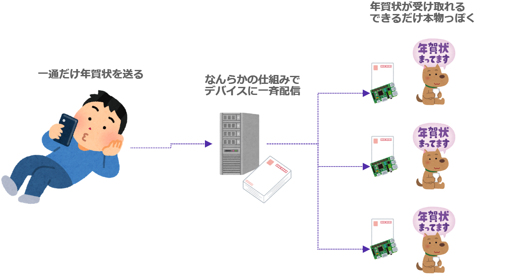
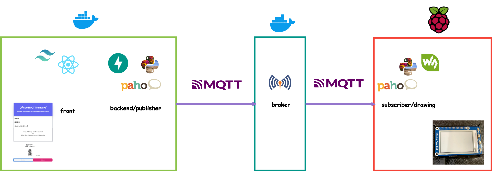
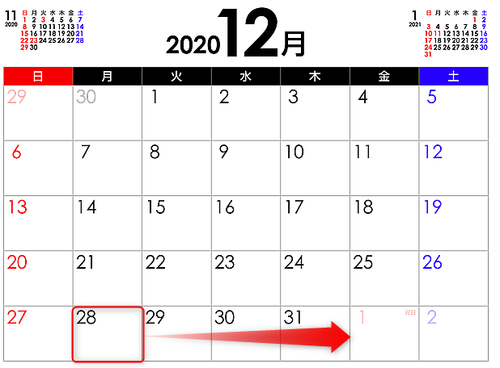

# MQTTと電子ペーパーを使って年賀状を作る

Yu Otsubo

---

## 自己紹介

- Yu Otsubo
- 27歳・独身
- 普段はChatbotの開発をしてます

---

## 日本人ならではの悩み

---

---

## 悲しいですねっ....

<!-- .slide: data-background="#02A8F4" -->

---

## 送らなければいいのでは？(正論)

---

---

---

# ということで

---

# なんとかしてみよう

---

## 年賀状の何がめんどくさいのか？

- - -
- 年賀はがきをたくさん購入しなければいけない <!-- .element: class="fragment" data-fragment-index="1" -->
- 同じ文章をたくさん書かなければいけない <!-- .element: class="fragment" data-fragment-index="2" -->
- 気の利いたイラストを載せなければいけない <!-- .element: class="fragment" data-fragment-index="3" -->
- 提出期限がある(1/1必着の場合) <!-- .element: class="fragment" data-fragment-index="4" -->

---

## 全部解決してみよう！ IoTで。

<!-- .slide: data-background="#ff5152" -->

---

### 注意

私はIoTの専門家ではないので、いい加減なことを言っているかもしれません。

ご了承ください。

---

## 雑なアイディア

---

# 材料準備

技術選定も兼ねて材料集めに入ります。

---

## 電子ペーパー

結構中華製電子ペーパーがAmazonに売ってます。

本当は[M5Paper](https://m5stack.com/products/m5paper-esp32-development-kit-960x540-4-7-eink-display-235-ppi?variant=37595977908396)使いたかった...

これで本物に近い年賀状デバイスができそうだ！

---

## Raspberry PI

家に転がっていたラズパイに電子ペーパーをドッキング！！

もともとドッキングしてたCoral君とはバイバイ

---

## Web Application

最近流行っている組み合わせをお勉強で使ってみる

---

## MQTT

IoT機器を絡めたPub/SubモデルはMQTTが有名なので使ってみる

---

#### 雑に設計

- フロントにはModern Brothersを利用
- バックエンドにはAPIサーバーとしてFastAPI、MQTT利用のためにPahoを利用
- MQTTブローカーは自前でDocker上にMosquittoで構築
- Pahoを使って電子ペーパー搭載のラズパイに年賀状を送る

---

## 今年が終わっちゃう！💦

早く作らないと...。

<!-- .slide: data-background="#B867C6" -->

---

## できた！

デモ動画

---

---

# Thank you

---
